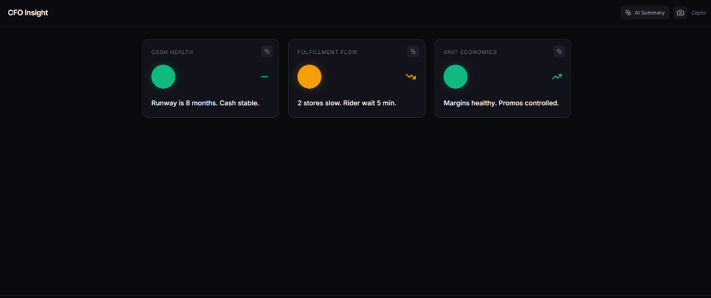
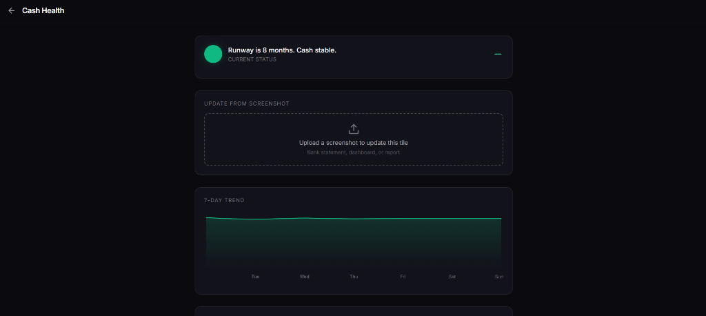
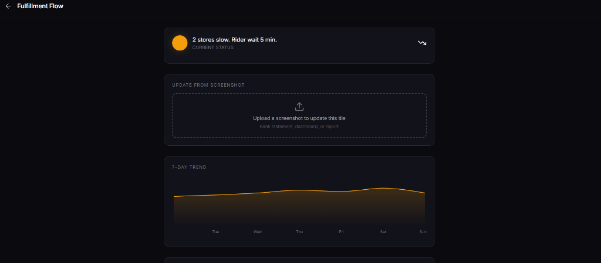
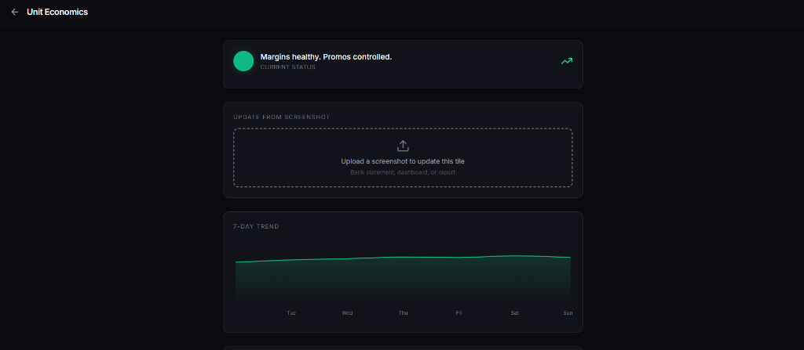
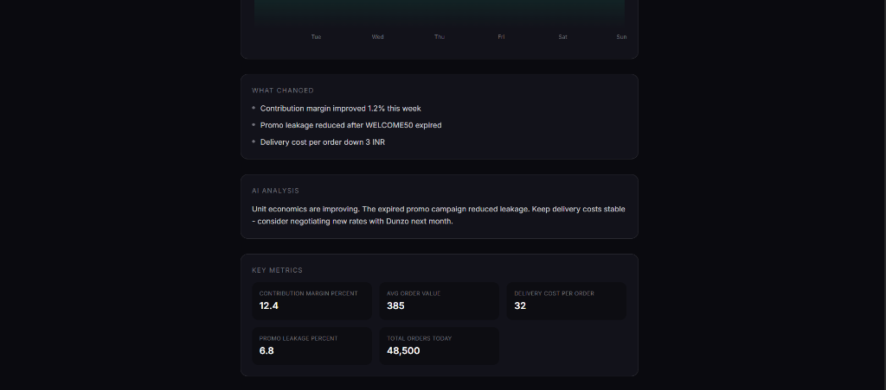

# CFO Insight

A mobile-first executive dashboard for Q-Commerce CFOs. Get real-time visibility into Cash Health, Fulfillment Flow, and Unit Economics with AI-powered summaries.

  

## Screenshots

### Dashboard


### Cash Health - Drill Down


### Fulfillment Flow - Drill Down


### Unit Economics - Drill Down


### Key Metrics & AI Analysis


## Features

- **3 Status Tiles** - Cash Health, Fulfillment Flow, Unit Economics
- **AI Summaries** - GPT-4o generates CEO-friendly insights
- **Screenshot Analysis** - Upload any dashboard, AI extracts metrics
- **7-Day Trends** - Drill-down charts for each metric
- **Real-time Data** - Integrates with Stripe, Plaid, OpenAI

## Tech Stack

| Layer | Technology |
|:--|:--|
| Framework | Next.js 14 (App Router) |
| Language | TypeScript |
| Styling | Tailwind CSS |
| Charts | Recharts |
| Icons | Lucide React |
| AI | OpenAI GPT-4o |
| Payments | Stripe API |
| Banking | Plaid API |

## Quick Start

### 1. Install Dependencies

```bash
cd frontend
npm install
```

### 2. Configure Environment

Create `.env.local` with your API keys:

```bash
# Stripe (Test Mode)
STRIPE_SECRET_KEY=sk_test_your_key_here

# OpenAI
OPENAI_API_KEY=sk-proj-your_key_here

# Plaid (Optional)
PLAID_CLIENT_ID=demo
PLAID_SECRET=demo
PLAID_ENV=sandbox

# App
NEXT_PUBLIC_APP_URL=http://localhost:3000
```

### 3. Run Development Server

```bash
npm run dev
```

Open [http://localhost:3000](http://localhost:3000)

## Project Structure

```
frontend/
├── src/
│   ├── app/                    # Next.js Pages
│   │   ├── page.tsx           # Home (3 tiles)
│   │   ├── vision/page.tsx    # Screenshot upload
│   │   └── tile/[id]/page.tsx # Drill-down view
│   ├── lib/                    # Services
│   │   ├── stripe.ts          # Stripe integration
│   │   ├── bank.ts            # Plaid integration
│   │   ├── genai.ts           # AI summaries
│   │   └── vision.ts          # Screenshot analysis
│   ├── components/
│   │   └── StatusTile.tsx     # Reusable tile
│   └── data/
│       ├── mock.json          # Demo data
│       └── trends.json        # Trend data
└── .env.local                  # API Keys (not committed)
```

## API Endpoints

| Endpoint | Method | Purpose |
|:--|:--|:--|
| `/api/metrics` | GET | Tile data |
| `/api/metrics/[id]` | GET | Drill-down details |
| `/api/ai/summaries` | GET | AI-generated summaries |
| `/api/integrations/stripe` | GET | Stripe revenue data |
| `/api/integrations/bank` | GET | Plaid cash data |
| `/api/tile/[id]/analyze` | POST | Tile screenshot analysis |

## Features Overview

### Home Dashboard
- 3 status tiles with color indicators (Green/Amber/Red)
- Trend arrows (Up/Down/Stable)
- AI enhance button on each tile

### Drill-Down View
- 7-day trend chart
- What Changed insights
- AI Analysis summary
- Key metrics grid
- Screenshot upload for tile update

### Screenshot Analysis
- Drag-and-drop upload
- GPT-4o Vision extracts metrics
- Supports bank statements, dashboards, reports

## Environment Setup

### Stripe (Test Mode)
1. Create account at [dashboard.stripe.com](https://dashboard.stripe.com)
2. Get test API key (starts with `sk_test_`)
3. Create test payments with card `4242 4242 4242 4242`

### OpenAI
1. Create account at [platform.openai.com](https://platform.openai.com)
2. Generate API key
3. Requires GPT-4o access

### Plaid (Optional)
1. Create account at [dashboard.plaid.com](https://dashboard.plaid.com)
2. Get sandbox credentials
3. Link test bank accounts

## Deployment

### Vercel (Recommended)

```bash
npm install -g vercel
vercel
```

Add environment variables in Vercel dashboard.

## License

MIT

## Author

Built with Next.js, TypeScript, and AI
